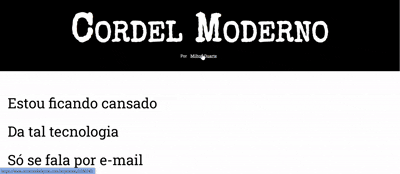

<h1 align="center"><strong>Cordel Moderno 📜</strong></h1>

---

## 📖 **Cordel Moderno**
**Cordel Moderno** é um projeto desenvolvido durante o curso de **HTML5 e CSS3** do **Curso em Vídeo**, ministrado pelo professor Gustavo Guanabara. Inspirado pela rica tradição dos cordéis, ele une poesia e tecnologia em uma interface visual moderna e responsiva.

---

## 🎨 **Demonstração Visual**
<p align="center">
  
</p>


## 🛠️ **Tecnologias Utilizadas**
- 
  - Estrutura semântica com tags como `header`, `section`, `footer`, `p`, e `a`.

- 
  - Estilo modularizado e responsivo sem o uso de `@media-queries`, com variáveis para cores e fontes, além de efeitos visuais como sombras (`box-shadow`).

- **Fontes Personalizadas**: Integração com **Google Fonts** para as fontes _Roboto Slab_ e _Special Elite_.

---

## 📂 **Estrutura do Projeto**
```plaintext
Cordel-Moderno/ 
│ 
├── index.html 
├── readme.md
└── src/ 
  ├── css/
  │ ├── global.css
  │ ├── header.css
  │ ├── section-normal.css
  │ ├── section-image.css 
  │ └── footer.css 
  ├── favicon/ 
  │ └── favicon.ico 
  ├── fonts/
  │ └── fonts.txt
  ├── img/ 
  │ ├── background001.jpg 
  │ └── background002.jpg 
  └── color/
    └── color.txt 

```
---

## ✨ **Destaques do Projeto**

### 1️⃣ **HTML Semântico**
- Uso de tags como `header`, `section`, e `footer` para organizar o conteúdo de forma acessível e alinhada às boas práticas.
- Links com atributo `target="_blank"` para abrir páginas externas sem comprometer a navegação.

### 2️⃣ **CSS Modularizado**
- Organização do estilo em arquivos CSS separados por componente: cabeçalho, seções e rodapé.
- Uso de variáveis CSS para definir cores e fontes, garantindo consistência e fácil manutenção.

### 3️⃣ **Design Responsivo e Visual**
- Backgrounds com **imagens fixas** e ajuste de posição (`background-attachment: fixed;`).
- Efeitos de sombra (`box-shadow`) para destacar elementos visuais.
- Texto com **contraste ideal** e **legibilidade**, aplicado em fundos transparentes.

---

## 🎓 **Aprendizados**
Este projeto consolidou habilidades importantes:
1. Estruturar páginas com **HTML semântico** de forma clara e acessível.
2. Criar estilos consistentes usando **CSS modularizado** e variáveis.
3. Aplicar boas práticas de design responsivo para diferentes dispositivos.

---

## 💻 **Acesse o Projeto online**
👨🏻‍💻 [Cordel Moderno](https://brunotxrs.github.io/Cordel-Moderno/)

---

## 🔗 **Acesse o Projeto**
Confira o código completo no repositório do GitHub:
👉 [Cordel Moderno - GitHub](https://github.com/brunotxrs/cordel-moderno)

---

## 🖋️ **Créditos**
- **Poesia**: [Milton Duarte](https://www.recantodasletras.com.br/poesias/3186743)
- **Curso**: [Curso em Vídeo](https://www.cursoemvideo.com/)
- **Desenvolvedor**: [Bruno Teixeira](https://github.com/brunotxrs)

